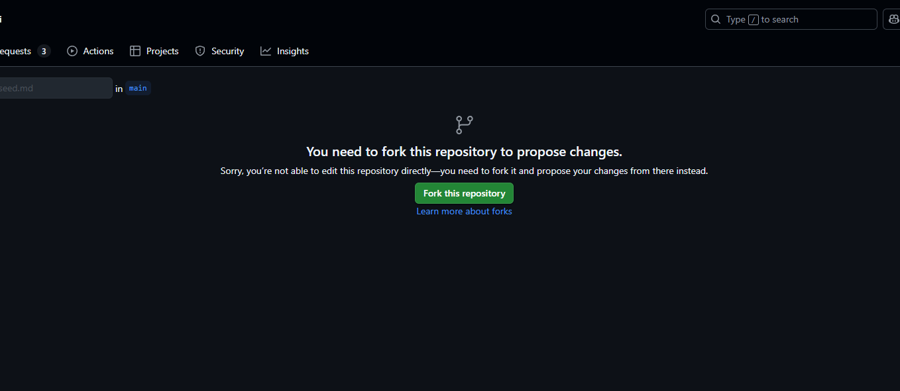
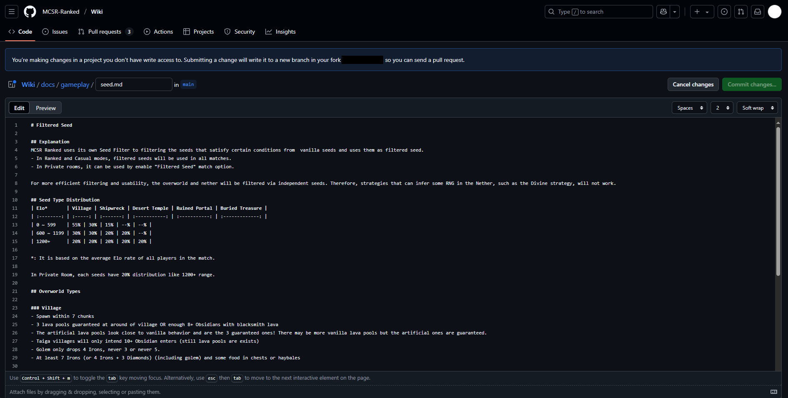
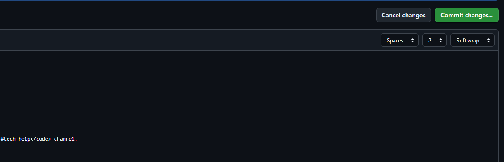
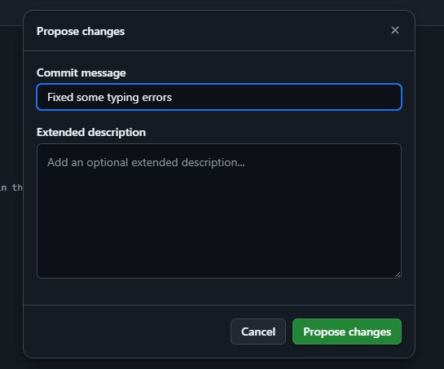

# Edit the Page

## Pull Request
If you know how to use GitHub, You can edit the documentation with follow the guidelines and make a Pull Request.

If you don't know how to use GitHub, please follow above steps.

## Starting with Edit

At the bottom of each page, there is a "Edit the page" button. Click on that button. 
If you are not logged in to GitHub, you will be taken to a login page. Just login :)

### First Time Edit

If it's your first time to edit the page, you will get this page. So you need to click "Fork this repository" button on the middle.

### Edit the page

You can now edit the content of this page. Click "Preview" button on the top left of editor to see how your content will appear on the page. If you are looking for formattings, see [here](./#markdown-format).

---

### Create an Edit Request

If you have done with editting, Click "Commit changes..." button on the top right of editor.

---

Then you will get this window. 
Espeically in "Commit message", you have to make a title of your edit request. This should be easy to what change is. 
If it's done, Click "Propose changes" button.

---

And Click "Create Pull Request" button. 

---

Now, it's done. You have to wait some review before apply into the page. 
If you want to check review process, see [this next document](./review) :)