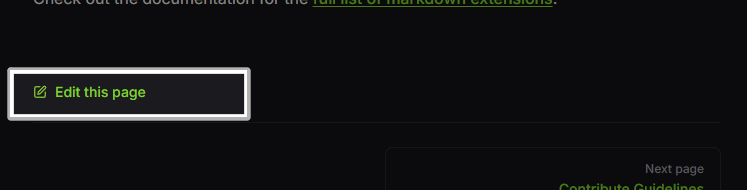
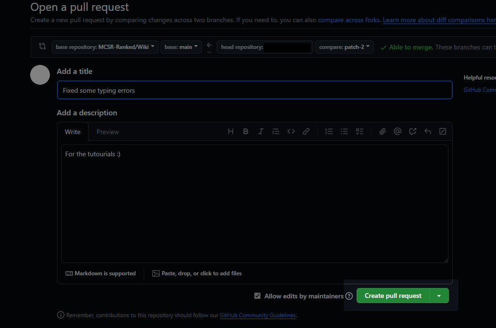

# Edit the Page

## Pull Request
If you know how to use GitHub, you can edit the documentation while following the guidelines and make a Pull Request.

If you don't know how to use GitHub, please follow the below steps:

## Starting with Edit

At the bottom of each page, there is a "Edit the page" button. Click on that button. 
If you are not logged in to GitHub, you will be taken to a login page. Just login :)

### First Time Edit

If it's your first time editing the page, you will get this page. In this case you need to click the "Fork this repository" button on the middle.

### Edit the page

You can now edit the content of this page. Click "Preview" button on the top left of the editor to see how your content will appear on the page. If you are looking for formattings, see [here](./#markdown-format).

---

### Create an Edit Request

When you are done with editing, click the "Commit changes..." button on the top right of the editor.

---

Then you will get this window. 
Espeically in "Commit message", you have to make a title of your edit request. This should make it easy to understand what your change is. 
When done, click the "Propose changes" button.

---

And click the "Create Pull Request" button. 

---

Now, it's done. You have to wait for the review before your change gets applied to the page. 
If you want to check review process, see [this next document](./review) :)
