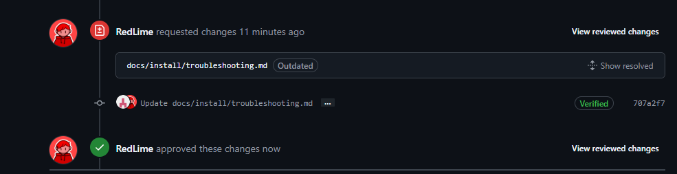

# Request Reviews

After you create the pull request, some maintainer will review it.

If there are no issues, it will be applied to the page. But you may be asked to change specific parts.

---

So, you can apply the suggestion to your request. But if you don't agree with the suggestion, leave a comment or discuss it on the [Discord server](https://mcsrranked.com/discord).

---

If you get an approval from maintainers, your changes will be applied to the page!
