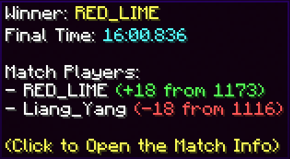
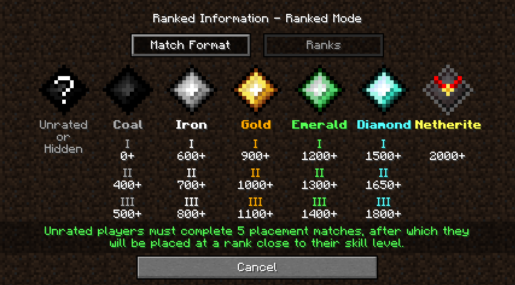

# Elo and Ranks

## What is Elo Rating?

MCSR Ranked has an Elo Rating system, much like [chess](https://www.chess.com/terms/elo-rating-chess), to rank players by how skilled they are at speedrunning. Elo is used for matchmaking players of similar skill, to provide competitiveness to the speedruns. (See: [Matchmaking](./matchmaking))

## How does Elo Work?

Upon account creation, players start with 1000 Elo. They can increase their Elo by winning, or decrease it by losing. Depending on the elo of your opponent, you can gain or lose more elo than usual.



*Redlime gains less Elo than the standard 20, since his opponent had less Elo than him.*

## Placement Matches

A player's first 5 matches are placement matches designed to predict their Elo rating. During these matches, the player's Elo is hidden.

## Elo Decay

Players who are in the top 150 on the [Elo Leaderboard](https://mcsrranked.com/stats) are at risk of Elo Decay. If they haven't played a Ranked match for 7 days, they will lose 5 Elo for each inactive day.

## Ranks

The playerbase is separated into 6 Ranks.

| Elo         | Rank      | Notes
| :---------: | :-------: | -----
| 0 ~ 599     | Coal      | Lowest rank in the game.
| 600 ~ 899   | Iron      | Unlocks Desert Temples as a seed type.
| 900 ~ 1199  | Gold      | Most common rank.
| 1200 ~ 1499 | Emerald   | Unlocks Buried Treasures as a seed type.
| 1500 ~ 1999 | Diamond   | This roughly represents the top 5% of players.
| 2000+       | Netherite | This roughly represents the top 0.5% of players.

They are further separated into Divisions as follows:



## Seasons and Phases

On a season end, all players with Elo above 1200 will have their Elo "reset" according to this formula:
$$
E' = \max(E - 1200, 0) \times 0.25 + E
$$
In English, players below 1200 Elo are unaffected. Any extra Elo above 1200 that a player has is quartered. For example:
```
Old Elo => New Elo
   1100 => 1100
   1300 => 1225
   1600 => 1300
   2200 => 1450
```

Players become unranked and have to play 5 matches to receive their new Elo.

Seasons are separated by (usually) 4 phases, each a month long. See all about the phase system here: [Phase Points](../playoffs/phase_point.md)
