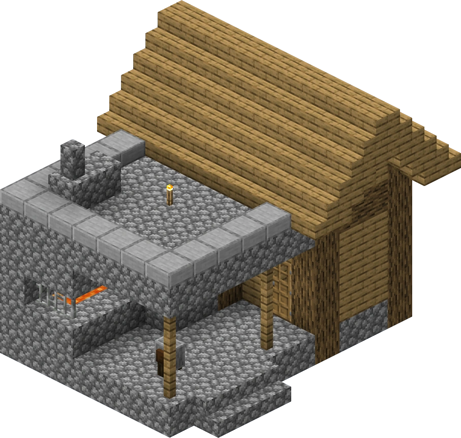
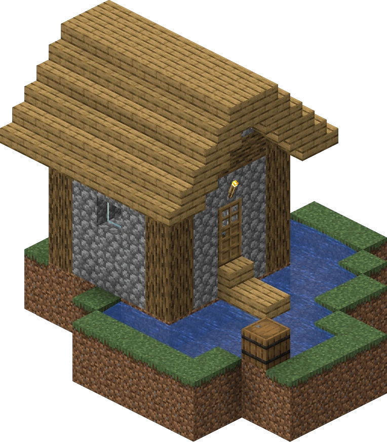
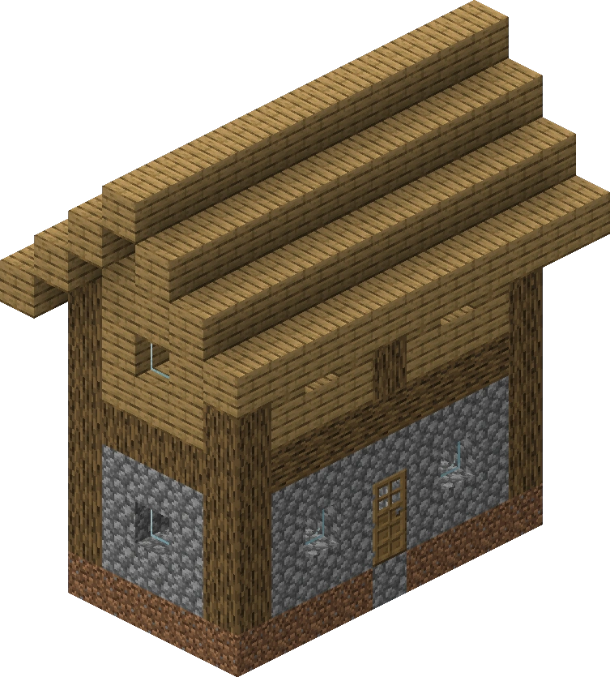
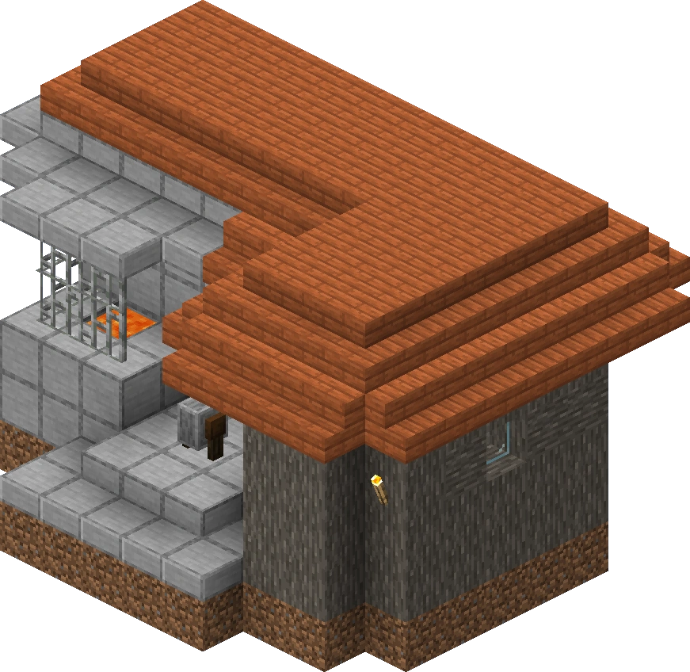
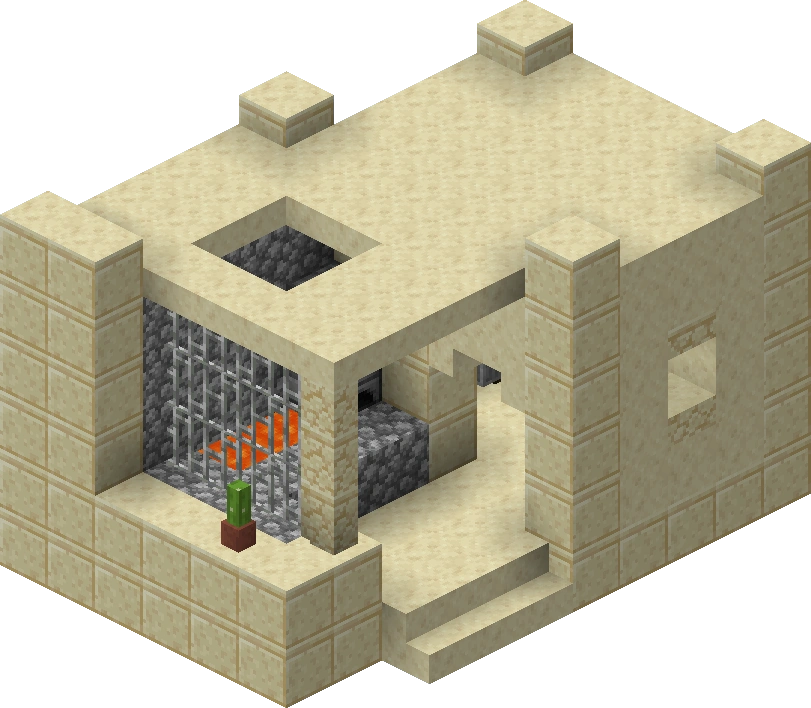
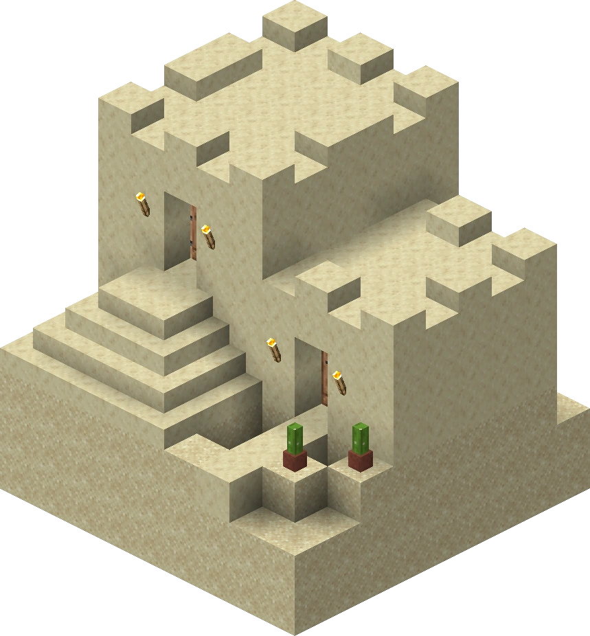
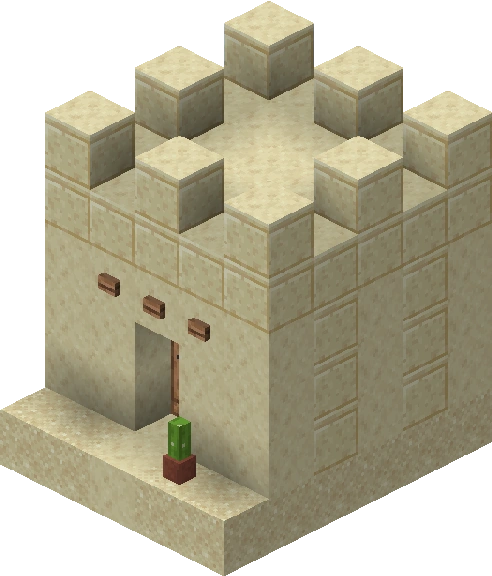
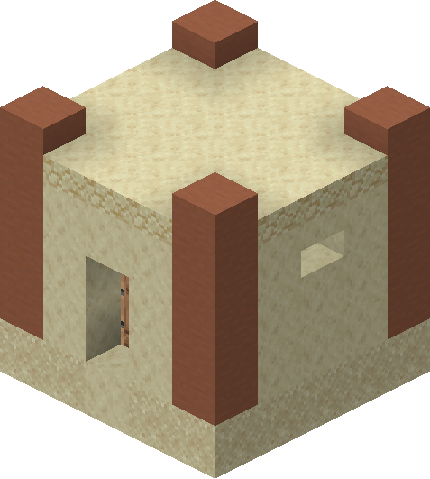

# Overworld: Village

## Introduction

Villages are often considered the simplest of overworld types and the most beginner friendly. They always have plenty of food, wood, and beds.

## Seed Type Distribution

|    Elo     | Village |
| :--------: | :-----: |
|  0 ~ 599   |   55%   |
| 600 ~ 1199 |   30%   |
|   1200+    |   20%   |

## Specifics

See [this page](../../seed.md)

## Goals

While very easy initially, the village seed type is often regarded as the most complicated seed type (or the most non-linear) as you can practically do most of your tasks in any order, adding a lot of variability.

This being said, the usual progression of the village is:

- Looting the blacksmith
- Getting 1-2 beds
- Getting 5+ haybales
- Getting flint
- Killing the golem if needed
- Entering

The first four goals can be at any point, so use the route that is the quickest and most linear.

# Strategies

Note: Taiga and Snowy Villages rarely appear and will not be covered in the strategies.

## All Village Strategies

- To kill the golem, simply stack up three blocks as he can't hit you and use your sword or axe.
  - You can place a crafting table at your feet to overlap crafting a boat, bread, and other items as your axe recharges its crit.
- If you get six iron, it is usually not worth it to woodlight with just an iron pickaxe and a bucket. Craft a shovel and shears instead.
  - If a ruined portal is close by, it is usually worth it to skip the golem due to a chance of flint, fire charges, and iron
- If you spawn next to a river, try to get flint by punching 3-4 pieces of gravel
  - You can overlap running to the lava pool and grinding gravel by running, placing gravel, and digging over and over.

## Plains Villages

### Blacksmith

 

### Fisher Cottage

- Has a Small Chance for a Bucket

### Hotel

- Always has 4 Beds

## Savanna Villages

- All small houses have a chance of having a bucket (but it's usually not worth checking all of them)
- There is no natural cobblestone, so you will have to dig down for it

### Blacksmith

## Desert Villages

- If you spawn close to wood, punch two logs so you can make tools to kill the golem in the village
- If not, punch dead bushes for at least two sticks to make an axe and find a crafting table house

### Blacksmith

### Toolsmith

### Crafting Table House

