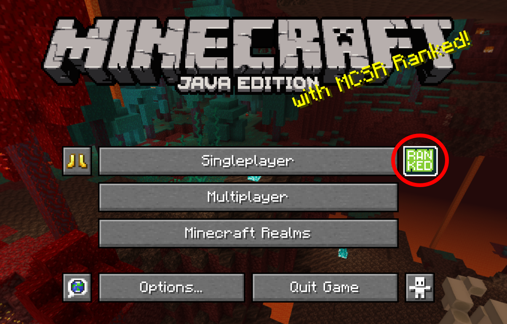
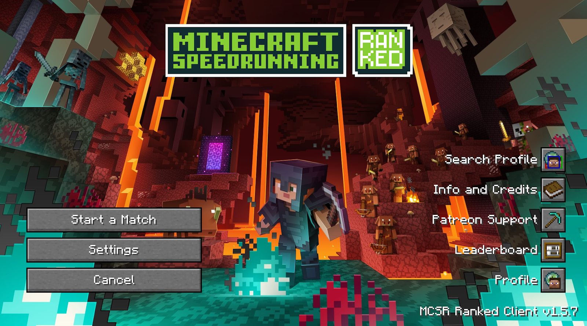
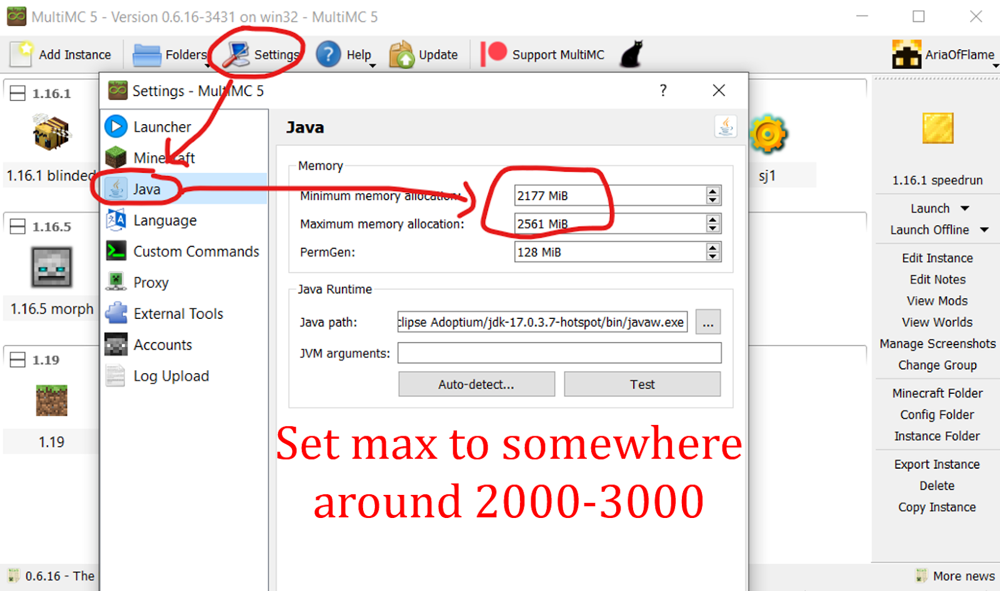
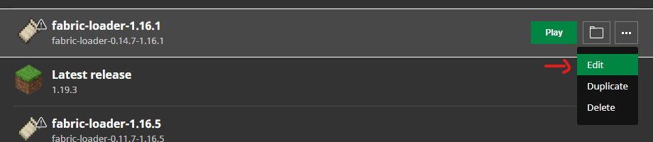
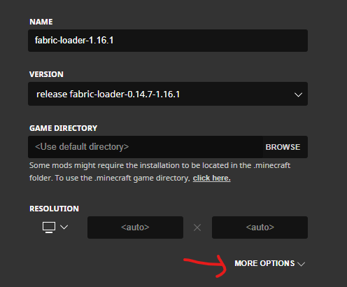
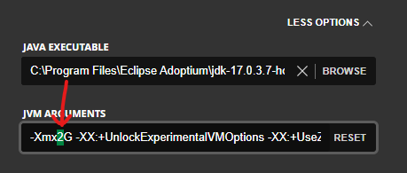
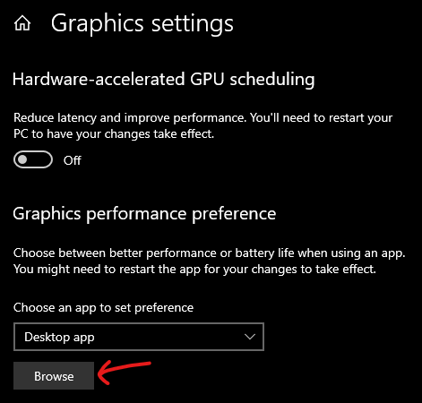
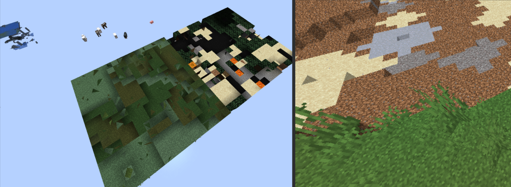

<div style="text-align:center;">
  
</div>

Check the table of contents on the right, or just Ctrl-F, to search through this document.

This document will focus on issues affecting Prism Launcher, MultiMC and other launchers, but you’re strongly advised to use Prism or MultiMC.

Credit to Ataraxia for writing the original version of this document.

::: tip
  💬 Having issues? Feel free to ask in our [Discord server](https://mcsrranked.com/discord) in the <code>#tech-help</code> channel.
:::

# Setup

## Where can I find information about Ranked?

- Website: <https://mcsrranked.com/>
- Discord: <https://discord.gg/nnjUSyDErj>
- Mod download: <https://modrinth.com/mod/mcsr-ranked/version/latest>
  - Since most speedrunners run on Minecraft 1.16.1, this mod is developed for 1.16.1. It will not work in other versions of Minecraft.
- The ranked menu looks like this in-game:

<div style="display: flex; gap: 2rem; justify-content: center; align-items: center;">
  
  
</div>

## How do I set up Ranked?

See [the installation guide](./install) for instructions.

## I have the mods but they don’t show up in-game (I don’t see the ranked button)

You need to install Fabric.

If you’re using Prism Launcher:

- Select your instance > Edit > Install Loader > Fabric.

If you’re using MultiMC:

- Select your instance > Edit Instance > Install Fabric.

If you’re using the default launcher:

- Follow the instructions [here](https://fabricmc.net/wiki/player:tutorials:install_mcl:windows), up to Step 3. Do not install Fabric API.

## How do I update my Java version? {#update-java}

- for Prism: follow [this guide](https://gist.github.com/maskersss/0993754fb91686f78f8c000280699fa4)
- for MultiMC / official launcher: follow the relevant section of [this guide](https://docs.google.com/document/d/1PIjyPMulI3r5aZpfywt5OQR_12qEzX5UTfU8DQHtNp8/edit?pli=1&tab=t.0#heading=h.62ygxgaxcs5a)

## The ranked button is greyed out and unclickable, hovering over it shows a “...” tooltip

- First, check if the ranked server is down (check #maintenances in the discord server).
- If it isn't down, check that the version of your ranked mod matches the latest release. Navigate to [your mods folder](#find-minecraft) and check the version number of the `mcsrranked` mod, comparing it to the [latest version](https://modrinth.com/mod/mcsr-ranked/version/latest). If they don’t match, replace your outdated mod with the latest version.
- Lastly, something on your end (network, firewall, antivirus, etc.) might be blocking the ranked mod from working. See [UnknownHostException](#unknownhostexception) for potential fixes.

## When I click the ranked button, I get “ERROR: Connection timed out”

See [UnknownHostException](#unknownhostexception).

## When I click the ranked button, it says “Player authentication data couldn’t be loaded from Minecraft Auth API”

If you’re on Prism/MultiMC:

- Close the game. In the launcher, select your account name (top-right of launcher), click “Manage accounts”, right-click your account and select “Refresh”.

If you’re on another launcher:

- Close the game and try restarting your launcher. If you still get the same error, sign out and sign in to the launcher.

If you’re on a cracked launcher:

- You need a [Minecraft account](https://www.minecraft.net/) to play Ranked, since Ranked requires your player UUID.

## My game fails to launch

You can browse through [Crashes](#crashes) to find the issue you’re having, but if you’re not sure or it’s too much to look through, see the guide at the top of [Crashes](#crashes) which will show you what files you’d need to send in #tech-help, so that others can help diagnose your issue.

## Where do I find my .minecraft folder / mods folder? {#find-minecraft}

If you're on Prism:

- Select your instance and click "Folder". Navigate to `minecraft/` or to `minecraft/mods/`.

If you’re on MultiMC:

- Select your instance and click “Minecraft Folder” to open your .minecraft folder, or “View Mods” to view your mods.

If you’re on the default launcher (Windows):

- Hold the Windows key and press R. Type in `%appdata%` and press Enter, then go into `.minecraft`. The `mods` folder is located within `.minecraft`.

If you’re on the default launcher (macOS):

- Go to `/Library/Application Support/minecraft`.
  - If you can’t find this folder, enable [Show hidden files](https://nordlocker.com/blog/how-to-show-hidden-files-mac/).

## How do I increase my brightness/gamma?

If you're using the latest version of Sodium, you can adjust the brightness level up to 500% via Options > Video Settings __from the title screen__.

Otherwise, go to your [.minecraft folder](#find-minecraft), open options.txt and change the value next to gamma to 5.0. This is the highest value allowed for speedrunning.

## How do I allocate more RAM to Minecraft? {#allocate-ram}

If you’re on Prism or MultiMC:

- Go to Settings > Java and set the maximum memory allocation to somewhere around 3000.

<div style="text-align:center;">
  
</div>

If you’re on the default launcher (though the default RAM allocation is fine):

1. Go to Installations, find the installation you’re using and click the “...” button. Click “Edit”.

<div style="text-align:center;">
  
</div>

1. Click “More Options”, then adjust the number after -Xmx.
    - You can change “G” to “M” to edit in terms of MB instead of GB.

<div style="text-align:center;">
  
  <br>
  
</div>

Do not allocate too much RAM since [it may cause lag spikes](https://vazkii.net/blog_archive/"%20\l%20"blog/ram-explanation).

## How do I get Minecraft to use my high-performance GPU? {#use-dgpu}

On Windows:

1. Press the Start button and type “Graphics settings”. Under Graphics performance preference, click “Browse”.

<div style="text-align:center;">
  
</div>

2. Select the javaw.exe that Minecraft is using, and set it to “High performance”.

If you don’t know where to find javaw.exe,

If you’re on Prism/MultiMC:

- Go to Edit (instance) > Settings > Java, and copy the path in “Java path”.

If you’re on the default launcher:

- Go to Installations, find the installation you’re using and click the “...” button. Click “Edit”, then “More Options”. Copy the path in “Java executable”.

Alternatively, you can follow steps 1-5 of [this guide](https://obsproject.com/kb/minecraft-java-edition-troubleshooting).

## I have worse performance than expected

This is usually caused by one or more of the following issues:

- [Not allocating enough RAM](#allocate-ram)
- [Using the bundled Java runtime](#update-java)
- [Using the integrated GPU](#use-dgpu) (if you have multiple GPUs) for the Java version you’re using

## How do I add custom commands like `!elo` on Twitch?

OshBot has some commands for Ranked like `+elo`, see [its documentation](https://bot.osh.gay/ranked/elo).

Additionally, there are some commands for Fossabot / Nightbot:

- (Fossabot) `!today` (replace MC_USERNAME with your minecraft username) - made by memerson
```
$(eval r=$(customapi https://mcsr-stats.memerson.xyz/api/matches?timeframe=$(urlencode $(uptime))&username=MC_USERNAME); r['error'] ? `${r['error']}` : `$(channel.display_name)'s stats since stream start - Elo: ${r['totalEloChange']} | Record: ${r['wonMatchesCount']} W - ${r['lossMatchesCount']} L - ${r['drawCount']} D`)
```
- (Fossabot) `!elo` (change BROADCASTER_MC_IGN to your Minecraft in-game name) – made by Neal
```
$(eval r=$(customapi <https://mcsrranked.com/api/users/$(index1> BROADCASTER_MC_IGN)); \`stats for ${r\['data'\]\['nickname'\]} - elo: ${r\['data'\]\['elo_rate'\]} | rank: ${r\['data'\]\['elo_rank'\]} | record: ${r\['data'\]\['records'\]\['2'\]\['win'\]} W - ${r\['data'\]\['records'\]\['2'\]\['lose'\]} L\`) | full leaderboard: <https://mcsrranked.com/leaderboard>
```

- (Nightbot) `!elo` (requires `!elohelper`, change BROADCASTER_MC_IGN to your Minecraft in-game name) – made by Neal
```
\-a=!elohelper $(eval \`$(1)\` == \`null\` ? \`BROADCASTER_MC_IGN\` : \`$(1)\`)
```
- (Nightbot) `!elohelper` – made by Neal
```
$(eval r=$(urlfetch json <https://mcsrranked.com/api/users/$(1)>); \`stats for ${r\['data'\]\['nickname'\]} - elo: ${r\['data'\]\['elo_rate'\]} | rank: ${r\['data'\]\['elo_rank'\]} | record: ${r\['data'\]\['records'\]\['2'\]\['win'\]} W - ${r\['data'\]\['records'\]\['2'\]\['lose'\]} L\`)
```

# Speedrunning

## My settings reset whenever I join a new world / Minecraft exits fullscreen whenever I join a new world

[StandardSettings](https://github.com/KingContaria/StandardSettings/releases/tag/v1.2.2) is a mod that resets your settings to specified values whenever you join a new world. You can find instructions on how to configure it [here](https://github.com/KingContaria/StandardSettings). If you don’t want your settings to reset, remove this mod from your mods folder.

## Entity counter (E counter) stays at -1 / blockEntities doesn’t appear when doing mapless or preemptive navigation

Go to Options > Video Settings and toggle Entity Culling off.

## E-ray can’t find far bastions

Go to Options > Video Settings and set your Entity Distance to 500%.

## Water is invisible / block textures don’t display properly

E.g.:

<div style="text-align:center;">
  
</div>

In the title screen, go to Options > Click the Book & Quill (top right) > Sodium and disable "Use Chunk Multi-Draw".

::: info
  Chunk Multidraw is a Sodium option that boosts performance. On a small percentage of GPUs, it will cause this issue, so you will have to disable it if you’re having this issue.
:::

## I can’t increase my render distance beyond 16 (or some other number)

[Allocate more RAM](#allocate-ram).

## Blocks don’t drop / entities are frozen

(also referred to as an “internal server crash”; it's in this section because the game doesn’t force quit like most crashes)

This is known as a ghost nether or phantom nether, and usually occurs when you change dimensions. Once you get this, there’s nothing you can do about it, since you’ve basically crashed (so you’ll need to restart Minecraft).

You can help us determine the cause of this issue. If you experience this, paste your [log file](#crashes) in #bug-report in the [Ranked discord server](https://discord.gg/nnjUSyDErj).

## I was teleported immediately after entering the nether (and took some fall damage / can't find my nether portal)

You were likely nether-bonked. This is when the game forgets to divide your coordinates by 8 when putting you in the nether from the overworld. It’s caused by going through a nether portal while left-clicking, so don’t hold down left-click at the time the portal animation finishes.

## Ninjabrainbot appears like a zip file, double-clicking it doesn’t run it

[Install Java](https://adoptium.net/temurin/releases/) if you haven’t already done so. If you already have java, download and run [Jarfix](https://johann.loefflmann.net/en/software/jarfix/index.html).

## I can’t press F3 without holding Fn / some F3 keys don’t work

Figure out a way to [toggle Fn-lock on your pc](https://mspoweruser.com/different-ways-to-lock-and-unlock-fn-key-in-windows-10-and-11/). If you’re on a Lenovo, the setting is in Lenovo Vantage > Device > Input & Accessories > Select F1-F12 function.

## How do I access the timer settings?

Go to Options -> Click the Book & Quill (top right) -> SpeedRunIGT.

## Can I practice seeds filtered with this mod?

You’ll have to practice by playing in matches (ranked, casual, or private rooms), or by recreating worlds saved to singleplayer (i.e. seeds you have played in previous matches).

# Crashes {#crashes}

If Minecraft crashes, you should send the log file and/or the crash report in #tech-help (in the [Ranked discord server](https://discord.gg/nnjUSyDErj)).

- If you’re on Prism or MultiMC, a console window will open when the game crashes. Click “Upload” to upload the log to a paste.ee/mclo.gs link, then copy the link and send it in #tech-help. It will contain both latest.log and the crash report, as well as more additional information:

<div style="text-align:center;">
  
</div>

- If you’re on a different launcher, [go to your .minecraft folder](#find-minecraft) > logs and select latest.log. Send this file in #tech-help:

<div style="text-align:center;">
  
</div>

- The crash report can sometimes be found in .minecraft/crash-reports, with the date of the crash in its file name. It contains a little more information about the crash itself, but the log file is usually sufficient to diagnose issues.
- If there’s an error message, sending a screenshot of that would be helpful too, in case there isn’t a crash report generated.

The following sections will go through common crashes. “Symptoms” means things to look for if you’re not sure what crash it is.

## Outdated Java version

Symptoms in the log file:

- “Java is version 1.8” under “Checking Java version…”
- “- java 8” under “Loading mods”
- “UnsupportedClassVersionError” followed by “has been compiled by a more recent version of the Java Runtime”

Explanation:

- Old versions of some mods and some practice mods require newer versions of Java than the version bundled with the game.

Fix:

- Update Java by following the steps linked [here](#update-java).

## 32-bit Java

Symptoms in the log file:

- “Error occurred during initialization of VM” followed by “Could not reserve enough space for \[memory allocated\] object heap”

Explanation:

- You can’t allocate RAM above a certain amount if you use 32-bit Java.

Fix:

- [Update Java to a 64-bit version](#update-java).

## JavaCheck.jar (on default launcher and Prism Launcher)

Symptoms:

- In the default launcher: Error message mentioning “Your Java Runtime is incompatible. Please edit your installation to use the bundled Java Runtime. Name: Java version mismatch”

<div style="text-align:center;">
  
</div>

- In Prism launcher: “This instance is not compatible with Java version…”

Explanation:

- Minecraft doesn’t like it when you change your java version.

Fix (default launcher):

- Watch [this video](https://youtu.be/HEtqR74M-_w). Read the pinned comment if you’re on the Windows store version of the launcher. You’ll have to do this every time the launcher updates.

Fix (Prism Launcher):

- Go to Settings > Java > enable Skip Java compatibility checks.

## Incompatible mods, outdated mods, or mods with dependencies

Symptoms:

- Error message mentioning “Incompatible mod set found!”, followed by a list of mods stating they are “not whitelisted”

Explanation:

- The ranked mod is only compatible with specific whitelisted mods to prevent cheating, and only specific versions of these mods are whitelisted. See the [list of allowed mods](https://mods.tildejustin.dev) for more details.

Fix:

- Refer to the error message; it will tell you which mods are not whitelisted and whether a different version of a mod you’re using is whitelisted. Remove the mods that are not whitelisted and [update](https://mods.tildejustin.dev/) the mods that the error message tells you to update.
- If you are still confused, it's possible that some mods just recently got updated and haven't been updated yet. Feel free to send a screenshot of the error message in #tech-help for help.

## Too little RAM allocated (usually only on MultiMC)

Symptoms in the log file:

- “OutOfMemoryError: Java heap space” (This error may also indicate a memory leak. Check your RAM allocation to determine which is more likely.)

Symptoms in the crash report:

- In “Memory” under “System Details”, there are three numbers in brackets. If the latter two are “1024 MB” or any number less than 1900 MB\*, you may have this issue.
  - \*If you are using Shenandoah GC and know what you are doing, having a lower memory allocation is fine, as long as it’s not too low (<1200 MB)

Explanation:

- By default, MultiMC allocates 1024 MB of RAM to Minecraft. This was sufficient for Minecraft versions before 1.13, but for anything after that, 1024 MB is too low. It should be set to somewhere from 2000 MB to 3000 MB, [but not too high](https://vazkii.net/blog_archive/"%20\l%20"blog/ram-explanation). You only really need a high RAM allocation (2800-3000) if you play on 32 render distance (possibly because you’re speedrunning All Advancements).

Fix:

- [Allocate more RAM to Minecraft](#allocate-ram).

## OneDrive (usually only on MultiMC)

Symptoms in the log file:

- “OneDrive” mentioned basically anywhere

Explanation:

- This occurs when your launcher folder is located in OneDrive while OneDrive is enabled. OneDrive can mess with your game files to save space, and this can to issues.

Fix:

- Move your launcher folder outside OneDrive, for example to "C:/MultiMC". If you want to unlink OneDrive, follow [this link](https://support.microsoft.com/en-au/office/turn-off-disable-or-uninstall-onedrive-f32a17ce-3336-40fe-9c38-6efb09f944b0).

## Memory leak (occurs more frequently for macOS users)

Symptoms in the log file:

- “OutOfMemoryError” (This error may also be caused by allocating too little RAM. Check your RAM allocation to determine which is more likely.)
- “There is insufficient memory for the Java Runtime Environment to continue”

Other symptoms:

- Minecraft using abnormally high RAM before the crash (check your task manager)

Explanation:

- Memory leaks occur when memory which is no longer needed is not released. Most commonly (in 1.16.1), the newest version of Sodium has a memory leak on macOS.

Fix:

- Assuming the memory leak is caused by Sodium, replace Sodium with a version downloaded from [this website](https://mods.tildejustin.dev/) after selecting Mac.

## Resizing the window to a large height

Symptoms in the log file:

- "java.lang.RuntimeException: GL_FRAMEBUFFER_INCOMPLETE_ATTACHMENT"

Explanation:

- Depending on your hardware, resizing the Minecraft window past a certain height will make it crash.

Fix:

- If you're using Jingle for it, reduce the height in Jingle -> Scripts -> Resizing.

## JVM crash

Symptoms in the log file:

- “A fatal error has been detected by the Java Runtime Environment” followed by “EXCEPTION_ACCESS_VIOLATION”
- “.minecraft\\hs_err_pid&lt;id&gt;.log”, where &lt;id&gt; is a few numbers

Other symptoms:

- A separate log file named hs_err_pid&lt;id&gt;.log (where &lt;id&gt; is a few numbers) appears in your .minecraft folder. This file technically has more information about the crash but no one can read it.

Explanation and fix: this crash may be caused by one of the following –

- Concurrently running programs, such as OBS and Discord, that use the same graphics card as the game.
  - Try using window capture instead of game capture in OBS.
  - Try disabling hardware acceleration in Discord.
  - If you're on a laptop, [make sure](#use-dgpu) Minecraft is using the dedicated GPU if you have one.
- A compatibility issue between SpeedrunIGT, Intel Graphics and OpenGL. Enable “safe font mode” in SpeedrunIGT options. If the game crashes before you can access that menu, delete .minecraft/speedrunigt.
- Driver issues. Check if your drivers are updated, and update them or downgrade them if they're already updated.

Generally, JVM crashes are difficult to diagnose, so there's not much we can help with if it isn't caused by one of the above issues.

## ConcurrentModificationException (CME)

Symptoms in the log file:

- “ConcurrentModificationException”, optionally accompanied with “Exception loading structure” or “StructureManager”

Explanation:

- CMEs are rare crashes that are basically caused by RNG. There is a fix for a specific CME in StructureManager in Java 11+ (see below), which crashes with “Exception loading structure” or with a mention of “StructureManager”.

Fix:

- Add [Voyager](https://github.com/modmuss50/Voyager/releases/tag/1.0.0) to your mods folder (you should do this regardless of whether you experienced this crash, so that future crashes may be prevented).

## UnknownHostException {#unknownhostexception}

Symptoms in the log file:

- “UnknownHostException: No such host is known (mcsrranked.com)”

Explanation:

- Something on your end (network, firewall, antivirus, etc.) is blocking the ranked mod from working.

Fix:

- Check if your firewall/antivirus is blocking mcsrranked.com.
- If it’s not a firewall/antivirus issue, [change your DNS provider](https://developers.google.com/speed/public-dns/docs/using"%20\l%20"windows) or use a VPN.

## Exit codes

Exit codes in log files usually aren’t sufficient to diagnose the problem.
