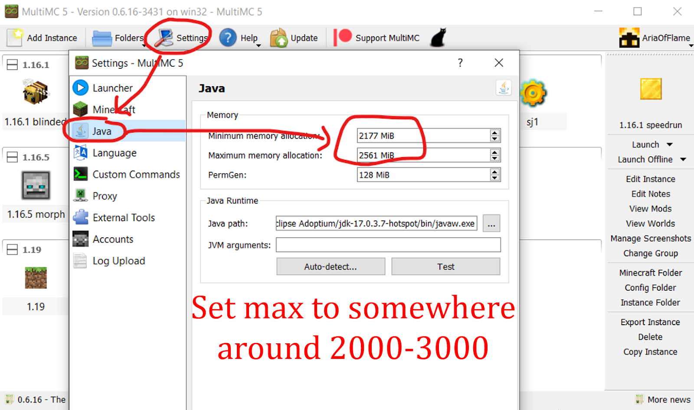
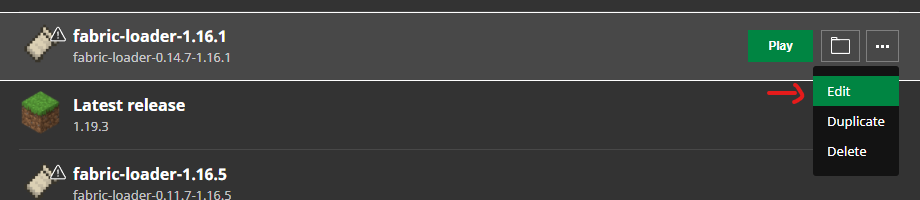
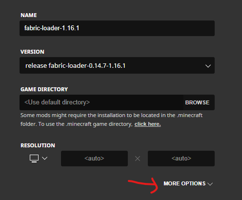
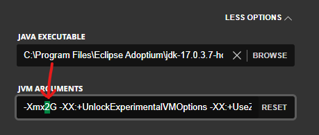
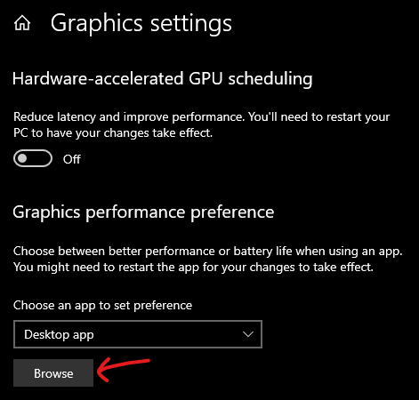
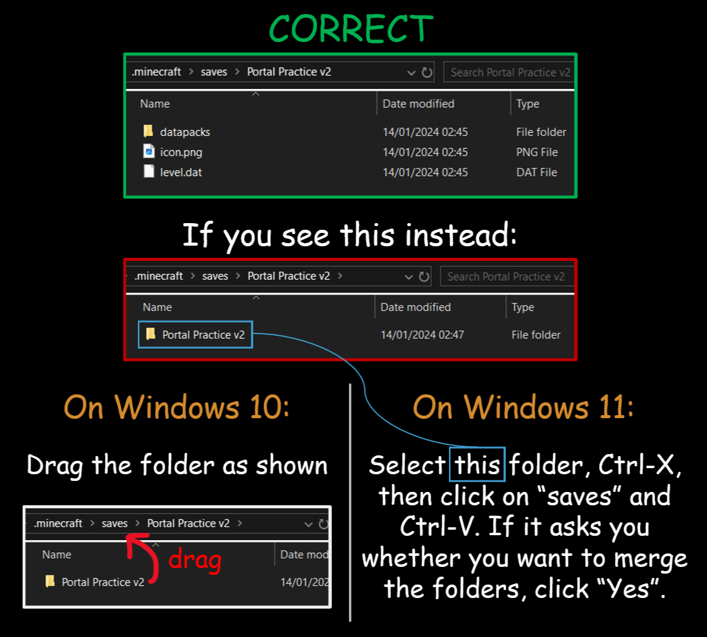
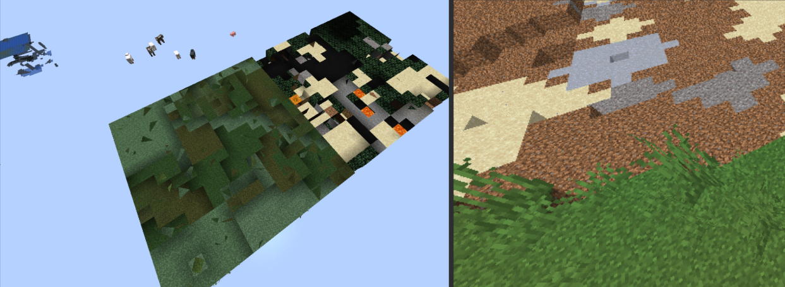
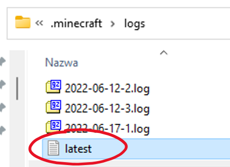
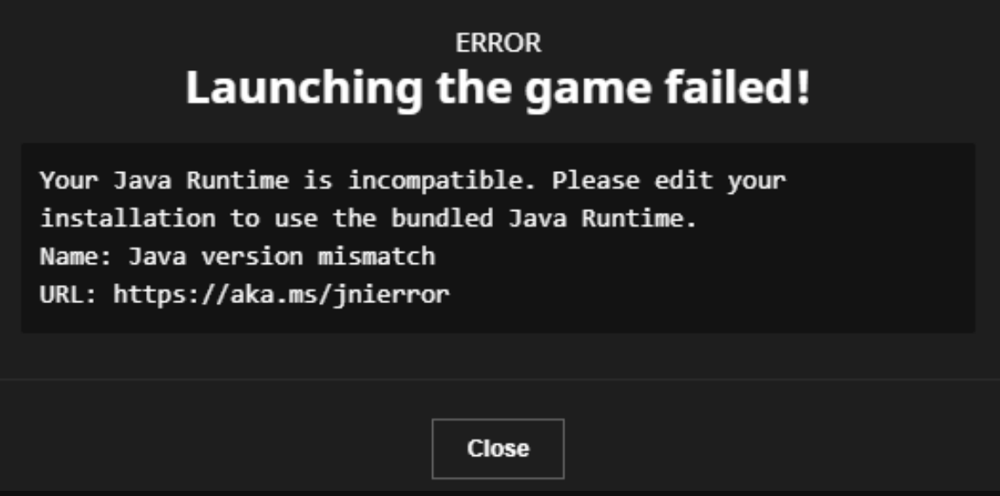

<div style="text-align:center;">
  
</div>

Check the table of contents on the right, or just Ctrl-F, to search through this document.

Credit to Ataraxia for writing the original version of this document.

::: tip
  💬 Having issues? Feel free to ask in our [Discord server](https://discord.mcsrranked.com) in the <code>#public-help</code> channel.
:::

::: tip
"MCSR" stands for "**M**ine**c**raft **S**peed**r**unning", **__not__** for "Minecraft Speedrunning Ranked". The mod is called "MCSR Ranked", or "Ranked" for short.
:::

# Setup

## Where can I find information about Ranked? {#info}

- Website: <https://mcsrranked.com/>
- Discord: <https://discord.mcsrranked.com/>

## How do I set up Ranked? {#setup-setup}

See [the download page](https://mcsrranked.com/download) or [the installation guide](./index) for your launcher for instructions.
  - Since most speedrunners run on Minecraft 1.16.1, this mod is developed for 1.16.1. It will not work in other versions of Minecraft.

## I am new. How do I get into speedrunning? {#new}

Follow [this video](<https://youtu.be/l-q-_4R8_6M>) for a tutorial to set up Minecraft for speedrunning. It goes through everything from setting up Prism Launcher to installing mods and practice maps, so it's highly recommended to watch this first. It mainly focuses on Windows; see [here for Linux](#linux) and [here for macOS](#macos) for more setup resources.

The most important things to learn when starting out are bastion routes and one-cycling. Watch [these videos](<https://www.youtube.com/playlist?list=PL7Q35RXRsOR-udeKzwlYGJd0ZrvGJ0fwu>) for introductory bastion routes and [this video](<https://youtu.be/JaVyuTyDxxs>) for one-cycling.

In general, it's a good idea to watch top runs and top runners' streams to get a feel of how a speedrun goes. Here's a [more comprehensive playlist](<https://www.youtube.com/playlist?list=PLwJbTWLH-1dakBZaROfNJZ-m59OQg_hFp>) and a [full comprehensive guide](<https://metafy.gg/guides/view/ultimate-minecraft-speedrun-guide-cIzfjeTmwOm>), but since they cover a lot of strategies it may seem overwhelming at first, so take it easy.

## My game fails to launch or crashes while playing

See [Crashes](#crashes) for a guide on troubleshooting a crash.

## How do I update my Java version? {#update-java}

Using Java 17+ is highly recommended for multiple reasons, such as performance and compatibility with some practice mods and MCSR Ranked features. At the time of writing this, downloading replays and Discord RPC require using a newer Java version.

- for Prism Launcher or MultiMC: follow [this guide](./install_prism#updating-java)
- for Modrinth App: follow [this guide](./install_modrinth#updating-java)
- for official launcher: follow [this guide](./install_vanilla#advanced-update-java)

## When I launch the game, I get a "Player authentication data couldn't be loaded from Minecraft Auth API" error {#failauth}

If you're on Prism/MultiMC:

- Close the game. In the launcher, select your account name (top-right of launcher), click "Manage accounts", right-click your account and select "Refresh".

If you're on another launcher:

- Close the game and try restarting your launcher. If you still get the same error, sign out and sign in to the launcher.

If you're on a cracked launcher:

- You need a [Minecraft account](https://www.minecraft.net/) to play Ranked, since Ranked requires your player UUID.

If the above don't work, try [updating Java](https://wiki.mcsrranked.com/install/faq#update-java).

## When I hover over the ranked button, I get "Failed to connect to server :\(" {#failed-to-connect}

- If you are from Russia, this is almost definitely due to internet censorship. People have reported that adding mcsrranked.com to zapret's lists/list-general.txt has fixed their issue.
- Else, check if the Ranked server is down (check #maintenances in the Discord server).
- If it isn't down, check that the version of your Ranked mod matches the latest release. [Navigate to your mods folder](#find-minecraft) and check the version number of the `mcsrranked` mod, comparing it to the [latest version](https://modrinth.com/mod/mcsr-ranked/version/latest). If they don't match, replace your outdated mod with the latest version.
- Lastly, something on your end (network, firewall, antivirus, etc.) might be blocking the ranked mod from working. See [network issues](#network) for potential fixes.

## Where do I find my .minecraft folder / mods folder? {#find-minecraft}

If you're on Prism:

- Select your instance and click "Folder". Navigate to `minecraft/` or to `minecraft/mods/`.

If you're on MultiMC:

- Select your instance and click "Minecraft Folder" to open your .minecraft folder, or "View Mods" to view your mods.

If you're on the default launcher (Windows):

- Hold the Windows key and press R. Type in `%appdata%` and press Enter, then go into `.minecraft`. The `mods` folder is located within `.minecraft`.

If you're on the default launcher (macOS):

- Go to `/Library/Application Support/minecraft`.
  - If you can't find this folder, enable [Show hidden files](https://nordlocker.com/blog/how-to-show-hidden-files-mac/).

## How do I increase my brightness/gamma? {#gamma}

It is legal to set gamma to up to 5.0.

If you're using the latest version of Speedrunning Sodium, you can adjust the brightness level up to 500% in-game via <code>Options</code> > <code>Video Settings</code> from the title screen, __not__ in the world.

Otherwise, go to your [.minecraft folder](#find-minecraft), open options.txt and change the value next to gamma to 5.0, or follow [the setup guide](#setup-setup) for a guide on setting up mods.

## How do I allocate more RAM to Minecraft? {#allocate-ram}

If you're on Prism or MultiMC:

- Go to Settings > Java and set the maximum memory allocation to somewhere around 3000.

<div style="text-align:center;">
  
</div>

If you're on the default launcher (though the default RAM allocation is fine):

1. Go to Installations, find the installation you're using and click the "..." button. Click "Edit".

<div style="text-align:center;">
  
</div>

1. Click "More Options", then adjust the number after -Xmx.
    - You can change "G" to "M" to edit in terms of MB instead of GB.

<div style="text-align:center;">
  
  <br>
  
</div>

Do not allocate too much RAM since [it may cause lag spikes](https://vazkii.net/blog_archive/"%20\l%20"blog/ram-explanation).

## How do I get Minecraft to use my high-performance GPU? {#use-dgpu}

On Windows:

1. For Windows 10, press the Start button and type "Graphics settings". Under Graphics performance preference, click "Browse". For Windows 11, under Graphics performance preference, click "Add desktop app."

<div style="text-align:center;">
  
</div>

2. Select the javaw.exe that Minecraft is using, and set it to "High performance".

If you don't know where to find javaw.exe,

If you're on Prism/MultiMC:

- Go to Edit (instance) > Settings > Java, and copy the path in "Java path".

If you're on the default launcher:

- Go to Installations, find the installation you're using and click the "..." button. Click "Edit", then "More Options". Copy the path in "Java executable".

Alternatively, you can follow steps 1-5 of [this guide](https://obsproject.com/kb/minecraft-java-edition-troubleshooting).

## I have worse performance than expected {#performance}

This is usually caused by one or more of the following issues:

- [Not allocating enough RAM](#allocate-ram)
- [Using Java 8 instead of 17+](#update-java)
- [Using the integrated GPU](#use-dgpu) (if you have multiple GPUs) for the Java version you're using

## How do I add custom commands like `!elo` on Twitch? {#elo-command}

OshBot has some commands for Ranked like `+elo`, see [its documentation](https://bot.osh.gay/ranked/elo).

Additionally, there are some commands for Fossabot / Nightbot:

- (Fossabot) `!today` (replace MC_USERNAME with your minecraft username) - made by memerson
```
$(eval r=$(customapi https://mcsr-stats.memerson.xyz/api/matches?timeframe=$(urlencode $(uptime))&username=MC_USERNAME); r['error'] ? `${r['error']}` : `$(channel.display_name)'s stats since stream start - Elo: ${r['totalEloChange']} | Record: ${r['wonMatchesCount']} W - ${r['lossMatchesCount']} L - ${r['drawCount']} D`)
```
- (Fossabot) `!elo` (change BROADCASTER_MC_IGN to your Minecraft in-game name) – made by Neal
```
$(eval r=$(customapi <https://mcsrranked.com/api/users/$(index1> BROADCASTER_MC_IGN)); \`stats for ${r\['data'\]\['nickname'\]} - elo: ${r\['data'\]\['elo_rate'\]} | rank: ${r\['data'\]\['elo_rank'\]} | record: ${r\['data'\]\['records'\]\['2'\]\['win'\]} W - ${r\['data'\]\['records'\]\['2'\]\['lose'\]} L\`) | full leaderboard: <https://mcsrranked.com/leaderboard>
```

- (Nightbot) `!elo` (requires `!elohelper`, change BROADCASTER_MC_IGN to your Minecraft in-game name) – made by Neal
```
\-a=!elohelper $(eval \`$(1)\` == \`null\` ? \`BROADCASTER_MC_IGN\` : \`$(1)\`)
```
- (Nightbot) `!elohelper` – made by Neal
```
$(eval r=$(urlfetch json <https://mcsrranked.com/api/users/$(1)>); \`stats for ${r\['data'\]\['nickname'\]} - elo: ${r\['data'\]\['elo_rate'\]} | rank: ${r\['data'\]\['elo_rank'\]} | record: ${r\['data'\]\['records'\]\['2'\]\['win'\]} W - ${r\['data'\]\['records'\]\['2'\]\['lose'\]} L\`)
```

## I am on Linux. How do I set everything up? {#linux}

See [here](https://its-saanvi.github.io/linux-mcsr) for a guide to setup Minecraft for speedrunning on Linux.

Use [resetti](https://github.com/tesselslate/resetti) for window resizing on X11.

Use [waywall](https://tesselslate.github.io/waywall) for window resizing on Wayland + many useful features.

You can join the MCSR Linux Discord server [here](https://discord.gg/CVxuagAXMt).

## I am on macOS. How do I set everything up? {#macos}

To set up speedrunning on Mac, follow [the macOS setup guide](https://www.youtube.com/watch?v=sRSR55A7VCE).

Use [SlackowWall](https://github.com/Slackow/SlackowWall/releases/latest) for resizing Minecraft.

Follow [this guide](https://youtu.be/RmAmL7JhGJw) to set up boateye.

You can join the Mac speedrunning Discord server [here](https://discord.gg/sczfsdE39W).

## Is there a Discord server for ...? (#discords)

You can find a spreadsheet of MCSR Discord servers [here](https://docs.google.com/spreadsheets/d/1W5D6sxqBfIdyxS1pVEAi2ZaFhOhj4x-9bZwD39HbgLo).

# Gameplay issues

## My settings reset whenever I join a new world / Minecraft exits fullscreen whenever I join a new world {#standardsettings}

StandardSettings is a mod that resets your settings to specified values whenever you join a new world. You can find instructions on how to configure it [here](https://github.com/contariaa/StandardSettings). If you don't want your settings to reset, remove this mod from your mods folder.

## Entity counter (E counter) stays at -1 / blockEntities doesn't appear when doing mapless or preemptive navigation {#entity-culling}

Go to Options > Video Settings and toggle Entity Culling off.

## E-ray can't find far bastions {#entity-distance}

Go to Options > Video Settings and set your Entity Distance to 500%.

## Decreasing the render distance by 1 doesn't unload the spawner {#lazychunks}

Spawners up to 3 chunks outside your render distance remain loaded and will still show up on the pie chart. This is why just dropping your render distance by 1 won't unload the spawner. You have to drop it by at least 4 to unload it.

*Example: If the spawner loads in at 15 chunks, you should decrease your render distance to 11 (press Shift-F3-F four times), then increase it to 14 (press F3-F three times). Reopen the pie chart and the spawner should be gone.*

## My buckets are glitchy / didn't pick up/place water {#ghostbucket}

Ghost buckets occur if your crosshair moves from one block to another as you right click with a bucket. Keep your mouse still while you right click to prevent them from occurring.

## Practice maps don't show up in the list of worlds {#folderinafolder}

Make sure your folder structure is correct:

<div style="text-align:center;">
  
</div>

## Water is invisible / block textures don't display properly {#multidraw}

E.g.:

<div style="text-align:center;">
  
</div>

In the title screen, go to Options > Click the Book & Quill (top right) > Sodium and disable "Use Chunk Multi-Draw".

::: info
  Chunk Multidraw is a Sodium option that boosts performance. On a small percentage of GPUs, it will cause this issue, so you will have to disable it if you're having this issue.
:::

## I can't increase my render distance beyond 16 (or some other number) {#rd-cap-16}

[Allocate more RAM](#allocate-ram).

## Blocks don't drop / entities are frozen {#ghost-nether}

(also referred to as an "internal server crash"; it's in this section because the game doesn't force quit like most crashes)

This is known as a ghost nether or phantom nether. Once you get this, if it isn't just Minecraft lagging a lot, there's nothing you can do about it, since you've basically crashed (so you'll need to restart Minecraft).

You can help us determine the cause of this issue. If you experience this, paste your [log file](#crashes) in #bug-report in the [Ranked discord server](https://discord.mcsrranked.com/).

## Ninjabrain Bot appears like a zip file, double-clicking it doesn't run it {#jarfix}

If you're having issues with .jar programs on Windows, download and run **Jarfix.exe** from [this page](https://github.com/qMaxXen/Jarfix/releases/latest).

## MiniPracticeKit doesn't work {#mpkdebug}

To troubleshoot MiniPracticeKit not working, please verify the following:
- A file that's at least 20 KB named **exactly** "hotbar" or "hotbar.nbt", __not__ "hotbar (1).nbt" or similar, exists in your .minecraft folder.
- You are pressing your **Hotbar slot 1** hotkey while holding your **Load hotbar** hotkey, and both of these aren't conflicting with other hotkeys.

## I can't press F3 without holding Fn / some F3 keys don't work {#fnlock}

Toggle Fn-lock on your pc <https://www.thewindowsclub.com/how-to-lock-and-unlock-function-fn-key-in-windows>. If you're on a Lenovo, the setting is in Lenovo Vantage > Device > Input & Accessories > Select F1-F12 function.

If you don't have an F3 key at all, which means you need to press Fn-3 to use F3, see [this section](#rebind) for a tutorial on how to rebind a key to F3.

## How can I rebind my F3 key or other keys that aren't possible to rebind in Minecraft? {#rebind}

- To rebind keys on Windows, [install Toolscreen](<https://www.youtube.com/watch?v=YqS-fxPx_jo>)
- In Toolscreen, navigate to Advanced  ➔ Inputs  ➔ Keyboard  ➔ Open Keyboard Layout
- Rebind keys by right-clicking. A more detailed rebind tutorial is available [here](<https://youtu.be/LG13ljK9RPs?t=486>) (timestamped)

If you are on Mac or Linux, see [#macos](#macos) or [#linux](#linux) for other resources.

### Rebind Rules {#rebind-rules}

You may remap keys using external programs, but:
- Each game input may have only one key, and each key may cause only one game input
- F3 shortcuts (such as F3+C, Shift+F3, etc.) can't be bound to a single button
- Inputs must be buttons - no scrolling the scroll-wheel or similar
- Rebinding "Attack/Destroy" or "Use Item/Place Block" to a keyboard button in order to abuse as an autoclicker is not allowed

## How can I disable the narrator? {#narrator}

Go to the Ranked main menu ⟶ **Settings** and set "Narrator Hotkey" to **OFF**.

## How do I access the timer settings? {#srigt-settings}

Go to Options -> click the Book & Quill (top right) -> SpeedRunIGT.

## Can I practice seeds filtered with this mod? {#singleplayer}

You can practice by playing in matches (ranked, casual, or private rooms), or by recreating worlds saved to singleplayer (i.e. seeds you have played in previous matches).

Playing by yourself in private rooms is possible only with a [paid supporter tier](https://mcsrranked.com/store) or with an alt account.

[FSG mod](https://modrinth.com/mod/fsg-mod) is a different mod with different filters that allows you to play filtered seeds.

## I was teleported immediately after entering the nether (and took some fall damage / can't find my nether portal) {#nether-bonking}

You were likely nether-bonked. This is when the game forgets to divide your coordinates by 8 when putting you in the nether from the overworld. It's caused by going through a nether portal while left-clicking, so don't hold down left-click at the time the portal animation finishes.

# Crashes {#crashes}

If Minecraft crashes, you should paste your log to the [log analyzer website](https://maskers.xyz/log-analysis/). If the response you get isn't helpful, or you need further help, please describe your issue and send the same log in the #public-help channel in the [Ranked discord server](https://discord.mcsrranked.com/).

- If you're on Prism or MultiMC, a console window will open when the game crashes. Click "Upload" to upload the log to a mclo.gs/pastee.dev link, then copy the link and send it. It will contain both latest.log and the crash report, as well as more additional information:

<div style="text-align:center;">
  
</div>

- If you're on a different launcher, [go to your .minecraft folder](#find-minecraft) > logs and select latest.log. Send this file:

<div style="text-align:center;">
  
</div>

- The crash report can sometimes be found in .minecraft/crash-reports, with the date of the crash in its file name. It contains a little more information about the crash itself, but the log file is usually sufficient to diagnose issues.
- If there's an error message, sending a screenshot of that would be helpful too, in case there isn't a crash report generated.

The following sections will go through some issues. "Symptoms" means things to look for if you're not sure what crash it is. This is mostly included for those who may be interested; it's not meant to be extensive, and the above is a way better way to diagnose a crash.

## Exit codes

Exit codes in log files are never sufficient to diagnose the problem. If you get a crash, please [send the full log](#crashes) when asking for help and not just the exitcode.

## Outdated Java version

Symptoms in the log file:

- "Java is version 1.8" under "Checking Java version…"
- "- java 8" under "Loading mods"
- "UnsupportedClassVersionError" followed by "has been compiled by a more recent version of the Java Runtime"

Explanation:

- Old versions of some mods and some practice mods require newer versions of Java than the version bundled with the game.

Fix:

- Update Java by following the steps linked [here](#update-java).

## 32-bit Java

Symptoms in the log file:

- "Error occurred during initialization of VM" followed by "Could not reserve enough space for \[memory allocated\] object heap"

Explanation:

- You can't allocate RAM above a certain amount if you use 32-bit Java.

Fix:

- [Update Java to a 64-bit version](#update-java).

## JavaCheck.jar (on default launcher and Prism Launcher)

Symptoms:

- In the default launcher: Error message mentioning "Your Java Runtime is incompatible. Please edit your installation to use the bundled Java Runtime. Name: Java version mismatch"

<div style="text-align:center;">
  
</div>

- In Prism launcher: "This instance is not compatible with Java version…"

Explanation:

- Minecraft doesn't like it when you change your Java version.

Fix (default launcher):

- Watch [this video](https://youtu.be/HEtqR74M-_w). Read the pinned comment if you're on the Windows store version of the launcher. You'll have to do this every time the launcher updates.

Fix (Prism Launcher):

- Go to Edit > Settings > Java > enable Skip Java compatibility checks.

## Incompatible mods, outdated mods, or mods with dependencies

Symptoms:

- Error message mentioning "Incompatible mod set found!", followed by a list of mods stating they are "not whitelisted"

Explanation:

- The ranked mod is only compatible with specific whitelisted mods to prevent cheating, and only specific versions of these mods are whitelisted. See the [list of allowed mods](https://mc.sr/mods) for more details.

Fix:

- Refer to the error message; it will tell you which mods are not whitelisted and whether a different version of a mod you're using is whitelisted. Remove the mods that are not whitelisted and [update](https://mc.sr/mods/) the mods that the error message tells you to update.
- If you are still confused, it's possible that some mods just recently got updated and haven't been updated yet. Feel free to send a screenshot of the error message in #public-help for help.

## Too little RAM allocated (usually only on MultiMC)

Symptoms in the log file:

- "OutOfMemoryError: Java heap space" (This error may also indicate a memory leak. Check your RAM allocation to determine which is more likely.)

Symptoms in the crash report:

- In "Memory" under "System Details", there are three numbers in brackets. If the latter two are "1024 MB" or any number less than 1900 MB\*, you may have this issue.
  - \*If you are using Shenandoah GC and know what you are doing, having a lower memory allocation is fine, as long as it's not too low (<1200 MB)

Explanation:

- By default, MultiMC allocates 1024 MB of RAM to Minecraft. This was sufficient for Minecraft versions before 1.13, but for anything after that, 1024 MB is too low. It should be set to somewhere from 2000 MB to 3000 MB, [but not too high](https://vazkii.net/blog_archive/"%20\l%20"blog/ram-explanation). You only really need a high RAM allocation (2800-3000) if you play on 32 render distance (possibly because you're speedrunning All Advancements).

Fix:

- [Allocate more RAM to Minecraft](#allocate-ram).

## OneDrive (usually only on MultiMC)

Symptoms in the log file:

- "OneDrive" mentioned basically anywhere

Explanation:

- This occurs when your launcher folder is located in OneDrive while OneDrive is enabled. OneDrive can mess with your game files to save space, and this can to issues.

Fix:

- Move your launcher folder outside OneDrive, for example to "C:/MultiMC". If you want to unlink OneDrive, follow [this link](https://support.microsoft.com/en-au/office/turn-off-disable-or-uninstall-onedrive-f32a17ce-3336-40fe-9c38-6efb09f944b0).

## Memory leak (occurs more frequently for macOS users)

Symptoms in the log file:

- "OutOfMemoryError" (This error may also be caused by allocating too little RAM. Check your RAM allocation to determine which is more likely.)
- "There is insufficient memory for the Java Runtime Environment to continue"

Other symptoms:

- Minecraft using abnormally high RAM before the crash (check your task manager)

Explanation:

- Memory leaks occur when memory which is no longer needed is not released. Most commonly (in 1.16.1), the newest version of Sodium has a memory leak on macOS.

Fix:

- Assuming the memory leak is caused by Sodium, replace Sodium with a version downloaded from [this website](https://mc.sr/mods/) after selecting Mac.

## Resizing the window to a large height

Symptoms in the log file:

- "java.lang.RuntimeException: GL_FRAMEBUFFER_INCOMPLETE_ATTACHMENT"

Explanation:

- Depending on your hardware, resizing the Minecraft window past a certain height will make it crash.

Fix:

- If you're using Jingle for it, reduce the height in Jingle -> Scripts -> Resizing.

## JVM crash

Symptoms in the log file:

- "A fatal error has been detected by the Java Runtime Environment" followed by "EXCEPTION_ACCESS_VIOLATION"
- ".minecraft\\hs_err_pid&lt;id&gt;.log", where &lt;id&gt; is a few numbers

Other symptoms:

- A separate log file named hs_err_pid&lt;id&gt;.log (where &lt;id&gt; is a few numbers) appears in your .minecraft folder. This file technically has more information about the crash but no one can read it.

Explanation and fix: this crash may be caused by one of the following –

- Concurrently running programs, such as OBS and Discord, that use the same graphics card as the game.
  - Try using window capture instead of game capture in OBS.
  - Try disabling hardware acceleration in Discord.
  - If you're on a laptop, [make sure](#use-dgpu) Minecraft is using the dedicated GPU if you have one.
- A compatibility issue between SpeedrunIGT, Intel Graphics and OpenGL. Enable "safe font mode" in SpeedrunIGT options. If the game crashes before you can access that menu, delete .minecraft/speedrunigt.
- Driver issues. Check if your drivers are updated, and update them or downgrade them if they're already updated.

Generally, JVM crashes are difficult to diagnose, so there's not much we can help with if it isn't caused by one of the above issues.

## ConcurrentModificationException (CME)

Symptoms in the log file:

- "ConcurrentModificationException", optionally accompanied with "Exception loading structure" or "StructureManager"

Explanation:

- CMEs are rare crashes that are basically caused by RNG. There is a fix for a specific CME in StructureManager in Java 11+ (see below), which crashes with "Exception loading structure" or with a mention of "StructureManager".

Fix:

- Add [Voyager](https://github.com/modmuss50/Voyager/releases/tag/1.0.0) to your mods folder (you should do this regardless of whether you experienced this crash, so that future crashes may be prevented).

## Network issues {#network}

Symptoms in the log file:

- "UnknownHostException: No such host is known (mcsrranked.com)"
- "java.net.SocketTimeoutException: Connect timed out"

Explanation:

- Something on your end (network, firewall, antivirus, etc.) is blocking the Ranked mod from working.

Fix:

- If you are from Russia, this is almost definitely due to internet censorship. People have reported that adding mcsrranked.com to zapret's lists/list-general.txt has fixed their issue.
- Try again later.
- Check if your firewall/antivirus is blocking mcsrranked.com.
- Try [changing your DNS provider](https://developers.google.com/speed/public-dns/docs/using"%20\l%20"windows).
- Try using a VPN/proxy.
- Try rebooting your PC.
- Try rebooting your router.
- [Make sure ipv6 works fine](https://test-ipv6.com/), if not, [try disabling it](https://www.google.com/search?q=how+to+disable+ipv6+on+windows).
- On Windows, run these 3 commands in cmd launched as admin:
<code>ipconfig /flushdns</code>,
<code>netsh interface ip reset</code>,
<code>netsh winsock reset</code>;
and reboot afterwards.
- Try using a different network.
